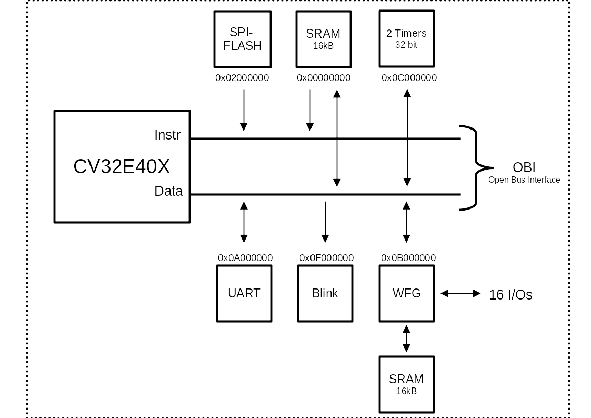

# Tristan Project

Custom instructions for the CV32E40X on an ASIC using SKY130.

# Setup

I created a small setup script that needs to be placed *alongside* the cloned repository.

```
.
├── tristan-asic (this repository)
├── dependencies (create this folder)
└── setup.sh
```

The contents of the script `setup.sh` are:

```
#!/bin/bash 

# Absolute path to this script
SCRIPT=$(readlink -f "$0")

# Absolute path this script is in
SCRIPTPATH=$(dirname "$SCRIPT")
echo $SCRIPTPATH

export OPENLANE_ROOT=$SCRIPTPATH/dependencies/openlane_src 
export PDK_ROOT=$SCRIPTPATH/dependencies/pdks

export PDK=sky130B
```

Before doing anything in this repository, first activate this script:

	> source setup.sh

To install OpenLane run the following inside the root directory of this repository:

	> make setup

# Hardening

Clone all submodules:

	> git submodule update --init --recursive

Next build the preprocessed design in `tristan/`:

	> make preprocessed.v

Add the power pins manually to the `cv32e40x_top` module in `preprocessed.v`:

```
`ifdef USE_POWER_PINS
    inout vccd1,	// User area 1 1.8V supply
    inout vssd1,	// User area 1 digital ground
`endif
```

Inside the root directory harden the macros:

	> make cv32e40x_top

# SoC

Planned SoC:



# Macro of CV32E40X

